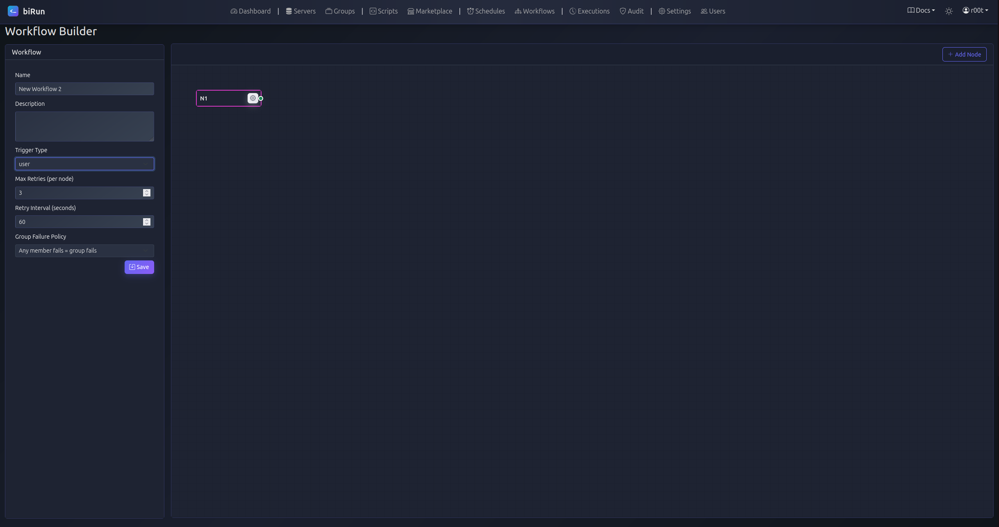
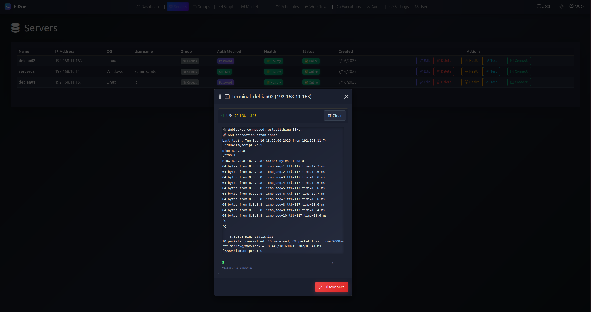
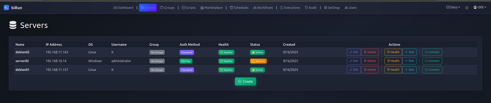
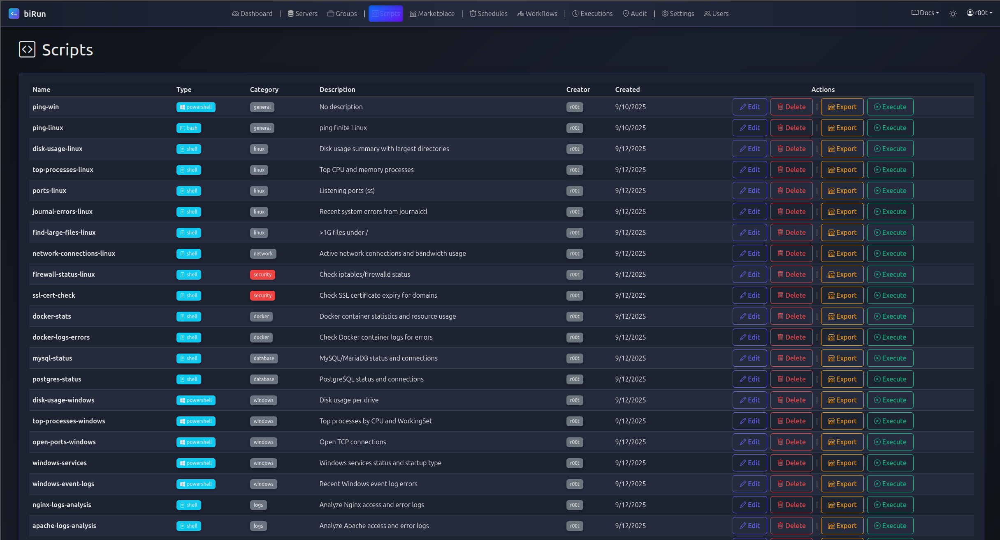
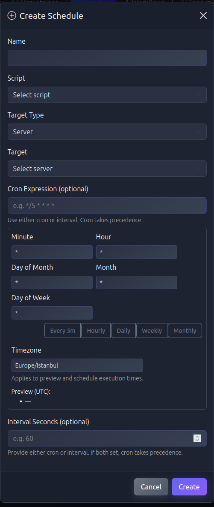
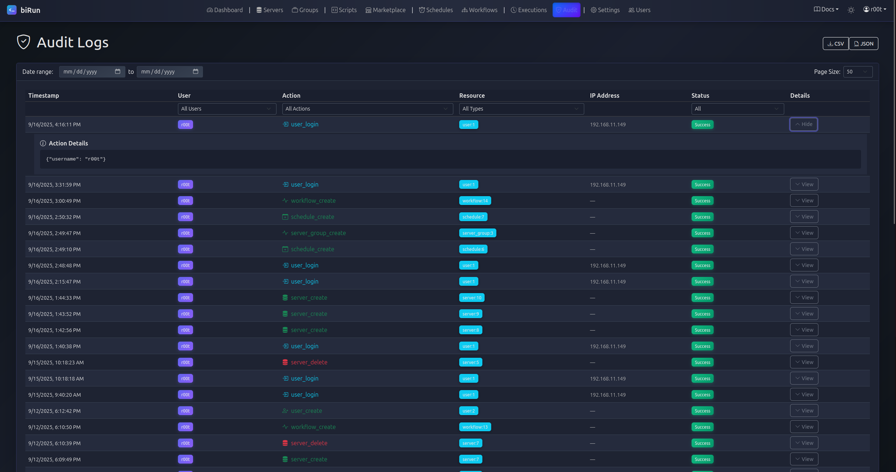
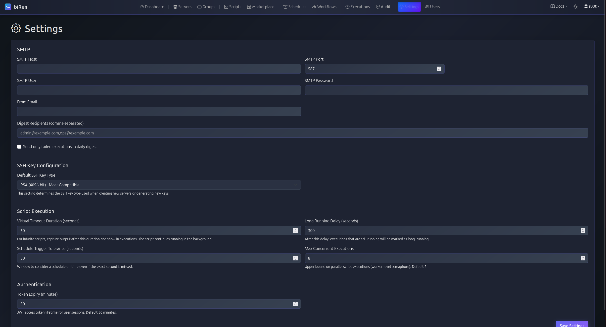
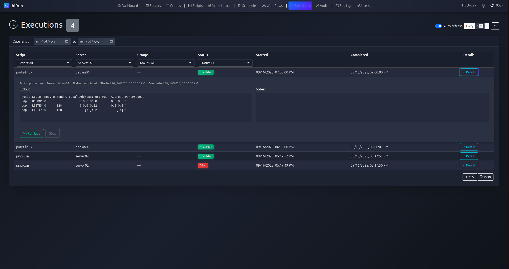

# Nuvis (Infrastructure Orchestration Platform)

[](https://www.python.org/)
[](https://fastapi.tiangolo.com/)
[](https://reactjs.org/)
[](https://www.docker.com/)
[](LICENSE)

**Nuvis** (formerly biRun) is a distributed infrastructure automation and orchestration platform designed for DevOps teams and SysAdmins. It enables centralized management, monitoring, and execution of scripts across heterogeneous server environments (Linux & Windows) without installing agents.

Unlike simple script runners, Nuvis features a powerful **Visual Workflow Builder (DAG)** capable of handling complex dependencies, conditional logic, and self-healing scenarios.

---

## 📸 Visual Tour

### 1. The Command Center
*Real-time system health, server status, and execution metrics at a glance.*


### 2. Visual Workflow Orchestration
**The Core Power of Nuvis:** A Node-based Workflow Engine. Define dependencies, set failure policies (e.g., "If Node A fails, run Cleanup Node B"), and visualize the execution path.


### 3. Live Remote Execution
Interact with remote servers directly via the web interface. Supports real-time stdout/stderr streaming over WebSocket/SSE.


---

## 🚀 Key Features

* **Agentless Architecture:** Connects to nodes via secure **SSH Tunnels** (Linux) or standard protocols, removing the need to install agents on target servers.
* **Multi-Language Support:** Natively supports **Bash**, **PowerShell**, and **Python** scripts.
* **Smart Scheduling:** Support for Cron expressions and Interval-based scheduling with "Trigger Tolerance" to handle missed execution windows.
* **Virtual Timeouts:** Intelligent handling of infinite processes (like `ping -t`) with snapshot logic to prevent zombie processes.
* **Audit & Security:** Immutable logs of every action and Role-Based Access Control (RBAC).

---

## 🔍 Deep Dive (UI Gallery)

<details>
<summary><strong>Click to expand and view the full interface gallery</strong></summary>
<br>

| Server Management | Script Management |
|:---:|:---:|
|  |  |
| *Inventory & Health Checks* | *Script Library & Types* |

| Scheduling (Cron) | Audit Logs |
|:---:|:---:|
|  |  |
| *Complex Time Definitions* | *Security Tracking* |

| Settings & Config | Execution Details |
|:---:|:---:|
|  |  |
| *System Tuning* | *Live Output Streams* |

</details>

---

## 🏗 Architecture

Nuvis follows a **Centralized Orchestrator Pattern** to ensure data integrity.

```mermaid
graph TD
    User((User))
    UI[React Frontend]
    API[Core API <br/> FastAPI]
    DB[(PostgreSQL)]
    Queue[(Task Queue <br/> Redis)]
    
    subgraph "Execution Layer"
        Worker[Worker Node]
    end
    
    subgraph "Target Infrastructure"
        Linux[Linux Server <br/> SSH]
        Win[Windows Server <br/> SSH/PS]
    end

    User --> UI
    UI --> API
    API <--> DB
    API -- "Push Job" --> Queue
    Queue -- "Consume" --> Worker
    Worker -- "Execute Script" --> Linux
    Worker -- "Execute Script" --> Win
    Worker -- "Result/Log" --> API
